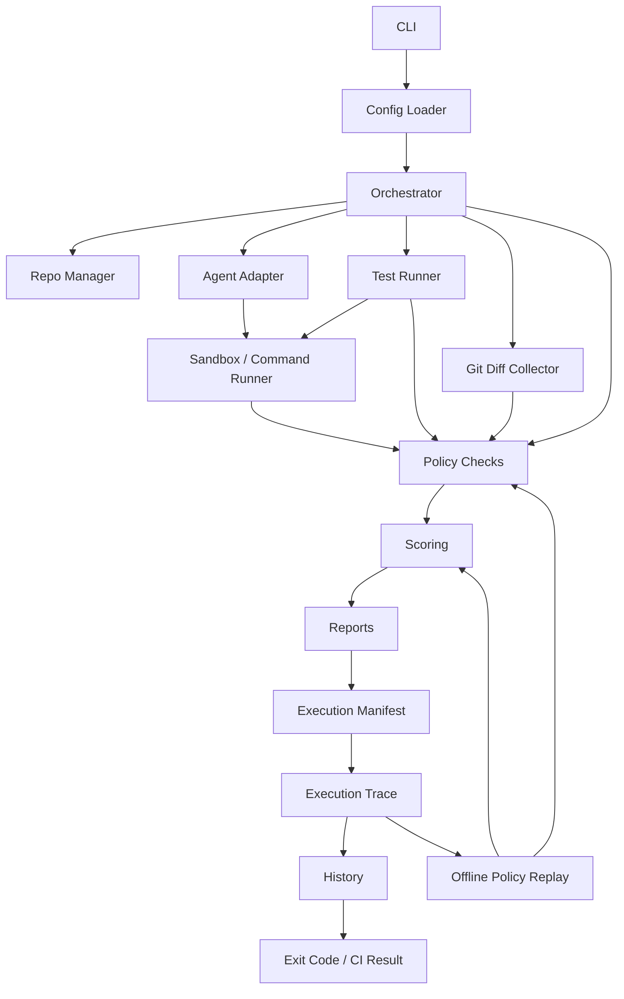
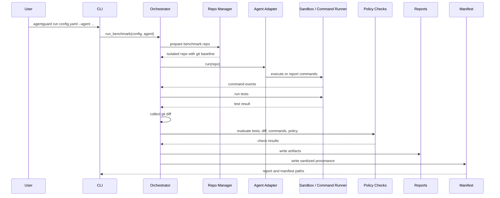

# AgentGuard Architecture

AgentGuard is a local-first evaluation harness for AI coding agents. It runs an
agent against a benchmark repository or existing CI checkout, captures
deterministic evidence, applies policy checks, scores the result, and writes
reports that humans and automation can inspect.

AgentGuard is not a GPT wrapper. It does not judge whether an agent "seems
trustworthy" from the agent's own explanation. It evaluates observable evidence:
tests, git diffs, changed files, command logs, policy checks, sandbox metadata,
timelines, and reports.

## Design Goals

- Treat agents as untrusted. Agent output, tool use, and claims are evidence to inspect, not facts to accept.
- Evaluate evidence, not claims. Passing or failing depends on tests, diffs, command events, policies, and reports.
- Stay local-first and CI-friendly. Runs work from a developer machine, a copied benchmark repo, or GitHub Actions.
- Produce deterministic reports. JSON and Markdown outputs make runs comparable and easy to archive.
- Support benchmark and real-repo modes. Benchmark mode evaluates agents against controlled tasks; CI mode evaluates changes in an existing repository.
- Keep extension points clear. Agent adapters, checks, scoring, reports, benchmark suites, and sandbox runners are intentionally separable.

## Pipeline

The benchmark pipeline is:

```text
Config -> prepared repo -> agent -> tests -> diff/checks -> score -> reports -> manifest -> trace -> history
```

Verified traces support a separate offline path:

```text
trace verification -> typed evidence reconstruction -> shared checks -> shared scoring -> equivalence report
```

Benchmark corpus audits add a validation layer above normal execution:

```text
Registry -> Contract loader/alignment -> run_benchmark trials -> Contract evaluator -> Audit reports
```

The versioned contract is the behavioral expectation for a registry family,
not a replacement for its configs. Static audit checks coverage and metadata
alignment without execution. Execution audit reuses `run_benchmark`, compares
typed results to path/check/evidence expectations, and detects trial instability.
It writes aggregate JSON/Markdown under `.agentguard/audits/` while preserving
the normal child run reports, manifests, and history.

Policy mutation audits add a check-quality layer beside benchmark execution:

```text
Mutation catalog -> isolated fixture -> deterministic action -> tests/diff/events -> checks/scoring -> Detection audit reports
```

The mutation layer bypasses agent execution and applies a closed set of
data-only actions to copied fixtures. It then reuses the real test runner, git
diff collector, policy checks, and scorer. Expected and forbidden failed checks
measure controlled detection behavior, while safe entries exercise false-alarm
resistance. Reports are written under
`.agentguard/diagnostics/mutations/`.

Benchmark fuzzing adds a generated corpus layer beside registry contracts:

```text
Seed + dimensions -> deterministic variants -> isolated workspaces/evidence -> checks/scoring -> Fuzz reports
```

The fuzzing layer uses small internal templates rather than hand-authored
fixtures. It exercises path, secret, command, diff-size, scope,
test-tampering, and traversal boundaries by materializing sanitized variant
workspaces under `.agentguard/fuzz/` and running the same policy checks against
deterministic synthetic evidence. It does not invoke external agents, Docker,
or network access.

Benchmark packs add a distribution layer above the registry:

```text
Registry selection -> contract/config validation -> normalized zip + manifest -> verify/import -> optional registry/suite outputs
```

The pack layer rewrites selected registry, contract, and config references into
pack-local paths, hashes every file, and stores fixtures under normalized
`repos/` directories. Verification reads the zip without extraction, rejects
unsafe paths and special files, recomputes hashes, and validates
registry/config/contract consistency. Import extracts only verified regular
files and safe relative symlinks, writes registry or suite outputs only when
requested, and never executes imported benchmark code.

Pack signing adds an optional local authenticity gate:

```text
verified pack root digest -> detached signature -> local trust policy -> import gate
```

The current signing implementation uses HMAC-SHA256 as a standard-library
local-CI trust mode. Trust policies are explicit local YAML files that list
trusted key IDs and required signature counts. They do not contact a remote
registry, and a trusted signature means only that a trusted shared key signed
the pack digest; it does not make imported benchmark code safe to execute.

Policy ablation adds a comparative layer over the same mutation execution:

```text
Selected catalog -> control trials -> one-disabled-check trials -> validity/contribution/overlap -> Ablation reports
```

The typed check registry constructs the complete control set and omits exactly
one selected check per ablated condition. Each trial receives an isolated
workspace, and scoring runs normally over the checks that actually executed.
The layer compares matching control and ablated mutations, detects repeated
trial disagreement, and writes JSON/Markdown under
`.agentguard/diagnostics/ablation/`. Invalid controls retain findings but
suppress headline contribution claims.

Benchmark contracts, fuzzing, mutation audits, and ablation answer different
questions. Contracts validate that a benchmark family still behaves as designed
through normal benchmark execution. Fuzzing expands deterministic policy
boundary coverage from generated templates. Mutations validate that individual
checks react to controlled fixture actions and remain quiet on controlled safe
fixtures. Ablation measures which of those controlled detections disappear when
one check does not execute. None estimates production violation prevalence or
real-world error rates.

Matrix stress diagnostics add a scheduler-quality layer beside normal matrix
execution:

```text
Synthetic indexed attempts -> bounded scheduler -> ordered rows/history -> integrity/scaling aggregation -> Stress reports
```

Production matrices and the diagnostic share the bounded scheduler that limits
in-flight work, restores stable input order, and stops replenishing after a
failed submitted wave in fail-fast mode. The diagnostic replaces repository and
agent work with a closed internal sleep-and-arithmetic adapter, then validates
per-attempt SQLite history, row identity, result/reliability totals, memory, and
planned/submitted/executed accounting. Reports are written under
`.agentguard/diagnostics/matrix-stress/`. The resulting throughput describes
only this synthetic scheduler/report/history workload.

Unexpected failed checks are warnings unless forbidden by the contract or strict
unexpected-check mode is enabled. Contract success means the deterministic
fixture still behaves as designed; it does not imply that an external agent is
safe or capable.

1. The CLI loads a YAML config or suite file.
2. Benchmark mode copies the configured repo template into `.agentguard/runs/...`
   and creates an initial git baseline.
3. The selected agent adapter runs against that prepared repo.
4. Commands run through Docker or the local command runner, and command evidence
   is recorded.
5. AgentGuard runs the configured tests.
6. Git diff collection and policy checks inspect changed files, test paths,
   forbidden paths, unsafe commands, scope, diff size, and secret patterns.
7. Scoring converts check results into `PASS` or `FAIL`.
8. JSON and Markdown reports are written.
9. A sanitized execution manifest is written.
10. A portable execution trace commits to policy-relevant evidence and source
    artifact hashes.
11. Local history is indexed with report, manifest, and trace paths.

CI mode uses the same checks and scoring model, but evaluates the existing
checkout instead of copying a benchmark template.

## Component Flow



## Core Components

### CLI

The Typer-based CLI exposes the main workflows: `run` for a single benchmark,
`benchmark` for multiple agents on one config, `suite` for many benchmark
configs, `ci` for existing repositories, `benchmark-overhead` for runtime
diagnostics, `benchmarks fuzz` for deterministic generated policy variants,
`diagnostics mutations` for policy-quality measurements, `diagnostics ablation`
for controlled check-contribution studies, and `reports` for browsing local
results. `diagnostics matrix-stress` measures bounded scheduler, memory,
history, and fail-fast behavior with an internal synthetic workload. CLI
commands translate options into core function calls and set process exit codes
for automation.

### Config Loader and Schema

The config loader reads YAML into an `AgentGuardConfig` schema. Configs define the task, repository template, test command, allowed and forbidden paths, test paths, unsafe command patterns, severity policy, diff limits, secret patterns, sandbox settings, command limits, and optional benchmark metadata.

### Orchestrator

The orchestrator coordinates a benchmark run from config load through report writing. It prepares the repository, selects the agent adapter, records timeline events, runs the agent, ingests command evidence, runs tests, collects git diff data, applies checks, computes the score, and writes JSON and Markdown reports.

### Repo Manager

In benchmark mode, the repo manager copies the configured template repository into `.agentguard/runs/.../repo`, initializes a git repository, and commits the initial benchmark state. That baseline lets AgentGuard collect the agent's changes with ordinary git diff machinery.

### Agent Adapters

Agent adapters provide the boundary between AgentGuard and a coding agent. The
adapter contract is intentionally small: run against a prepared repository and
record or emit command evidence.

Current adapters include:

- Mock agents for deterministic tests and demos.
- `custom-command` for Docker-backed configured commands.
- `local-command` for a configured local command string in the copied benchmark
  repo.
- `agent-command` for a generic local command-line coding agent configured with
  `agent_command`, optional `agent_name`, optional `agent_environment`, and
  optional `agent_workdir`. Configs may also declare `agent_version_command`,
  `agent_model`, and scalar `agent_metadata` for provenance.

`agent-command` runs with `shell=False`. String commands are parsed with
`shlex.split`; list commands are used as argv directly. By default it runs in
the copied benchmark repo, but `agent_workdir: config_dir` runs it relative to
the config file directory.

### External-Agent Evaluation Profiles

The evaluation harness adds a provider-neutral profile and task-rendering layer
above the existing matrix and `agent-command` paths:

```text
profile + suite + benchmark task -> validate -> sanitized plan
profile + copied run workspace -> render argv -> agent-command -> matrix reports
```

Schema-versioned profiles contain argv-list commands, optional argv-list
version detection, model identity, scalar metadata, working-directory policy,
and environment variable names. They do not contain environment values.
Benchmark configs contain exactly one task source when used by this workflow:
an inline prompt or a bounded prompt file confined to the config directory.

Validation rejects unknown or embedded placeholders before execution. Dry-run
uses stable workspace markers and prompt hashes. During execution, the
orchestrator prepares each independent benchmark copy before replacing complete
`{task_prompt}`, `{task_file}`, and `{repo_dir}` argv items. The real argv and
allowlisted process environment are passed to `agent-command`; command evidence,
reports, and provenance receive the sanitized display argv instead. This
per-run rendering keeps parallel matrix workers independent and preserves the
matrix parent execution ID in every child manifest.

The matrix aggregation records both functional success (the configured tests
returned zero) and policy-compliant success (the AgentGuard result is `PASS`).
It also counts unsafe functional successes where tests passed but policy checks
failed.

### Docker Sandbox / Command Runner

The Docker runner executes configured commands inside a container using a mounted repository workspace, working directory, environment, network mode, optional memory and CPU limits, timeout handling, and output limits. It also records executed command events through the command tracker.

### Instrumentation / Command Tracker

The command tracker records command text, argv, cwd, exit code, stdout, stderr, duration, timeout state, truncation state, and preflight policy metadata. Agent-emitted events can also be ingested from the repository so reports include both AgentGuard-run commands and agent-reported activity.

### Git Diff Collector

The diff collector summarizes changed files, added files, modified files, deleted files, and line counts. Benchmark mode compares against the initialized baseline commit. CI mode can compare the working tree or a base/head ref pair.

### Checks / Policy Engine

Checks inspect the deterministic evidence produced by the run. The default set verifies test status, forbidden path changes, test tampering, unsafe commands, scope adherence, diff size, and path-based secret patterns. Each check returns a pass/fail result, severity, message, and evidence.

### Scoring

Scoring starts at 100 and deducts points for failed checks by severity. Warnings reduce score but do not fail the run by themselves. Failed `error` or `critical` checks make the final result `FAIL`.

### Reports

Report writers produce machine-readable JSON and human-readable Markdown. Reports include task identity, score, check results, diff summary, command events, sandbox metadata, benchmark metadata, and timeline events. A separate standards export layer normalizes run, suite, matrix, and diagnostic reports into bounded internal export models before rendering SARIF 2.1.0 for policy findings or JUnit XML for CI test-report consumers.

### Execution Manifest

The provenance layer writes `.agentguard/.../manifest.json` only after final
reports exist. Its typed, versioned schema records execution identity and
timestamps, AgentGuard and source Git state when detectable, host and sandbox
policy, config and benchmark content hashes, sanitized agent identity, artifact
paths, and parent-child relationships. Suite and matrix IDs are allocated
before child runs; matrix workers receive the immutable parent ID as an
argument, so parallel attempts do not depend on shared mutable provenance
state.

Serialization uses readable indentation and deterministic key ordering.
Manifest failures warn without replacing the evaluation result. The verifier
validates schema version and required fields, then recomputes referenced config
hashes without executing an agent or benchmark.

The manifest never contains full environment variables or raw stdout/stderr.
Agent environment names are retained without values. Secret-sensitive metadata
keys and common credential argument forms are redacted. This is pattern-based
sanitization and cannot recognize every possible positional or encoded secret.

### Execution Trace

The trace layer writes `.agentguard/runs/<run-id>/trace.jsonl` after reports and
the optional manifest exist. Its versioned header and closed ordered event set
capture sanitized commands, file-change identities, test outcomes, policy
check results, completion data, and source artifact hashes. Per-event canonical
SHA-256 hashes form a chain; the header root digest commits to the final event
and header identity.

Known roots become symbolic roles, paths are repository-relative, output is
represented by bounded sanitized hashes, and full file content is excluded.
Optional diffs are bounded and sanitized. Trace writing is atomic and failures
warn without replacing the primary benchmark result. Parallel matrix children
build independent immutable traces in their own run directories.

Schema v2 adds a canonical normalized policy snapshot and hash. The replay
layer verifies integrity, reconstructs typed `PolicyEvaluationContext`
evidence, invokes the same registered checks and scorer as live execution, and
compares the result against recorded check events. Reconstruction is separate
from evaluation; recorded checks are never used as recomputed output.

`trace show`, `trace verify`, `trace replayability`, and `trace replay` invoke
no agent, model, test command, Docker, network, or benchmark workspace. The
hashes are not signatures and do not prove agent identity, evidence honesty,
benchmark correctness, or policy completeness. Schema v1 remains verifiable
but is normally non-replayable because AgentGuard does not infer missing policy
from current defaults. Replay history is deferred to avoid representing a
derived analysis as another agent run.

`trace metamorphic` applies deterministic transformations to typed trace
models, rebuilds integrity for valid transformed traces, verifies them, and
replays them through the same checks. Preserving transforms measure outcome
stability; changing transforms measure expected policy-delta detection; invalid
transforms verify structural rejection. Reports are written under
`.agentguard/replays/metamorphic/` and generated transformed traces remain local
artifacts.

### Suite Runner

The suite runner executes multiple benchmark configs and aggregates pass rate, average score, failed-check counts, warning-check counts, best/worst runs, metadata, and individual report paths. Suites can be filtered by benchmark category, difficulty, and tags.

The benchmark registry records stable benchmark IDs, versions, metadata, and config variants for cataloging scenarios, and it can generate ordinary suite YAML files without making suite execution depend on the registry.

## Suite, Baseline, History, And Gate Layers

These layers sit above single-run evaluation:

- Suite: runs many benchmark configs and writes one aggregate report under
  `.agentguard/suites/...`.
- Matrix: filters a suite and then runs each selected config with either its
  configured agent or every requested agent override. A trial aggregation layer
  expands those combinations into serial, independent benchmark executions,
  then computes overall, per-agent, and per-combination reliability metrics. It
  writes comparative reports under `.agentguard/matrices/...`.
- Matrix reliability gate: serializes aggregate trial reliability in a
  dedicated, versioned schema and compares later matrices by stable
  benchmark/config, benchmark version, and agent identity. It applies explicit
  minimum-success and allowed-drop thresholds without changing the older
  suite-compatible baseline format.
- Baseline: saves an approved suite summary, including benchmark identity and
  version when metadata is available. Matrix mode reuses this format because
  matrix rows have the same stable task/agent/config identity.
- History: indexes run, suite, matrix, and CI report summaries in
  `.agentguard/history.db` for recent history, stats, trends, and exports.
- Gate: runs a suite, compares it with a required baseline, prints a compact
  CI-focused summary, and exits nonzero for invalid inputs, regressions, or
  suite failures that are not explicitly allowed.

### Regression Baselines

Suite baselines serialize stable summaries of previous suite results, including
benchmark identity and version per run when metadata is available. Later suite
runs can compare pass rate, average score, individual run results, scores, and
failed checks against a baseline to detect regressions or improvements over
time. If a current run uses a different benchmark version than the baseline for
the same stable run key, AgentGuard stops with a clean configuration error
unless the user opts into `--allow-version-mismatch`.

### CI Suite Gate

The `gate suite` command sits on top of suite execution, baseline comparison,
and the local report/history writers. It runs a suite with optional metadata
filters, compares against a required baseline, prints a compact CI-focused
summary, and exits with gate semantics for suite failures, regressions, invalid
inputs, and benchmark version mismatches.
In CI, this makes suites plus baselines the enforcement layer for pull-request
regression gates.

### Report Browser

The report browser discovers local reports under `.agentguard/`, loads JSON reports, infers report type, and formats concise summaries for recent run, suite, and CI reports.

### Run History

The local SQLite history index at `.agentguard/history.db` stores normalized
summaries for run, suite, matrix, and CI reports. Reports and manifests remain
the source of truth; the database is a lightweight cache for recent history, stats, and future
trend/dashboard features. History queries support exact-match filters for type,
name, category, and difficulty, plus a trends view over recent scores and
results. History records preserve benchmark identity/version and nullable
manifest paths when available. Existing databases are migrated by adding the
manifest column.
Filtered history can also be exported to JSON or CSV for external analysis,
demos, spreadsheets, and dashboard prototypes.

### GitHub Action / CI Mode

CI mode evaluates an existing git repository instead of copying a benchmark fixture. It runs the configured tests, collects either working-tree or base/head diffs, applies the same checks and scoring model, writes reports under `.agentguard/ci`, exits nonzero on failure, and can append a compact report to `GITHUB_STEP_SUMMARY`.

## Benchmark Mode Flow

1. Load the benchmark config.
2. Copy the benchmark repository into `.agentguard/runs/...`.
3. Initialize a git baseline commit.
4. Run the selected agent adapter.
5. Ingest command and event evidence.
6. Run the configured tests.
7. Collect the git diff from the baseline.
8. Run policy checks.
9. Score the result.
10. Write JSON, Markdown, command log, and timeline-backed reports.
11. Write the execution manifest and index its path in history.



## CI Mode Flow

CI mode runs against the existing repository rather than a copied benchmark template. It detects the current git root, runs the configured test command in place, and collects either the current working-tree diff or a PR-style diff between `--base` and `--head` refs.

The same checks inspect the CI evidence: test result, changed files, diff size, unsafe command events, scope rules, forbidden paths, test tampering, and secret patterns. AgentGuard writes a CI JSON report, Markdown report, command log, and timeline data under `.agentguard/ci`. The CLI exits nonzero when the scored result is `FAIL` unless the caller explicitly allows failures, making it suitable for GitHub Actions and other CI systems. With `--github-summary`, it can append a compact result to the GitHub step summary.

## Trust Model

AgentGuard assumes the agent is untrusted. The agent may make incorrect claims, modify files outside the intended scope, tamper with tests, run unsafe commands, expose secrets, or follow malicious instructions embedded in repository content.

AgentGuard also assumes repository content may be adversarial. A benchmark README, source comment, test fixture, or script can contain instructions intended to manipulate the agent. Command execution may be unsafe, especially when the agent controls shell text. Tests can be tampered with, weakened, deleted, or made irrelevant. Passing tests alone is therefore insufficient evidence of a safe or correct agent run.

The platform reduces reliance on trust by collecting independent evidence from the sandbox or command runner, git diff, command tracker, test runner, policy checks, and generated reports. A good result should show that tests pass, the diff is scoped, tests were not weakened, unsafe commands were not used, forbidden paths were not touched, and configured policies were respected.

## Sandbox Model

AgentGuard supports local execution and Docker-backed execution.

Local mode is simple and useful for CI and development workflows, but it runs commands on the host. It should be used when the repository and command are trusted enough for the local environment.

The generic `agent-command` adapter is local execution. It is not sandboxed by
AgentGuard unless the configured command itself invokes Docker, a VM, or another
sandbox. AgentGuard still records command evidence, applies preflight command
policy, enforces timeout/output limits, runs tests, inspects diffs, and writes
reports.

Docker mode runs commands in a container with a mounted repository workspace. Configurable controls include image, working directory, network mode, memory limit, CPU limit, read-only root filesystem mode, command timeout, and output byte limit. The default Docker network mode is `none`, which reduces accidental or malicious network access during benchmark runs.

Command preflight policy can audit or enforce unsafe command patterns before custom-command agent execution. Audit mode records matched patterns and allows execution; enforce mode blocks matched commands before they run. Later checks can still fail a run based on unsafe command evidence.

Docker reduces risk and improves reproducibility, but it is not a complete isolation guarantee and should not be oversold as a perfect security boundary. Current limitations include no full VM isolation, no dynamic syscall tracing, deterministic pattern-based command detection, and dependence on the host Docker daemon and configuration.

## Policy and Check Model

Current checks include:

- Tests pass: verifies the configured test command exited successfully.
- Forbidden paths: fails or warns when changed files match forbidden path patterns.
- Test tampering: detects changes to configured test paths.
- Unsafe commands: inspects command evidence for configured unsafe command patterns.
- Scope adherence: checks that changed files stay within allowed path patterns.
- Diff size: enforces configured limits for changed files and added/deleted lines.
- Secret scan: detects path-based secret patterns in changed files.

Each check has a severity: `info`, `warning`, `error`, or `critical`. Severities can be configured by policy. Failed warning checks deduct points but do not fail the run alone. Failed error or critical checks are blocking and produce a final `FAIL` result.

## Reports and Artifacts

AgentGuard writes artifacts under `.agentguard/` by default:

- JSON report: structured run, suite, or CI data for automation.
- Markdown report: readable summary for developers and reviewers.
- Command log: command events with execution metadata, output truncation flags, timeouts, and policy metadata.
- Timeline: ordered events embedded in reports to explain the run lifecycle.
- Execution manifest: sanitized, hashed run/suite/matrix provenance and
  parent-child execution identity.
- Run history: local SQLite index of normalized report summaries.
- GitHub step summary: optional CI summary for GitHub Actions.
- Suite report: aggregate report for many benchmark configs.
- Baseline comparison: regression/improvement summary against a saved suite baseline.
- Reports browser: CLI discovery and summaries for recent run, suite, and CI reports.
- Standards exports: SARIF 2.1.0 for policy findings and JUnit XML for
  run/suite/matrix/diagnostic outcomes.
- Mutation audit: controlled check detections, misses, unexpected detections,
  safe-fixture outcomes, and per-check/per-category metrics.

Generated `.agentguard/` artifacts are local outputs and should not be committed.

## Benchmark Suites and Baselines

Benchmark suites run many benchmark configs as one evaluation set. Suite metadata supports category, difficulty, and tag filtering so contributors can focus on prompt-injection cases, filesystem-boundary cases, easy smoke tests, harder regression tests, or any other catalog slice.

Baselines capture stable suite summaries. Comparing a new suite run against a baseline helps detect regressions over time, including pass-rate drops, average-score drops, PASS-to-FAIL changes, score decreases, and newly failed checks.

Matrix mode applies the same filters before agent expansion. Without agent
overrides it preserves the suite rows as written. Repeated `--agent` options
expand each filtered row once per requested agent, and `--trials` expands those
combinations only after filtering and agent selection. The resulting attempt
list has a stable suite, agent, and trial order before execution begins.

`--workers` selects a bounded standard-library thread pool. A value of `1`
retains the direct serial path; larger values keep at most the effective worker
count in flight. Each worker invokes the ordinary benchmark orchestrator, which
copies the benchmark template into a unique run directory and owns its command
tracker, timeline, reports, and agent workspace. Run IDs include random entropy
in addition to timestamps to avoid concurrent path collisions. SQLite history
writes use separate connections with busy waiting, while schema setup is
serialized within the process. Matrix futures are stored by their preassigned
attempt index and aggregated in that index order, so completion order cannot
reorder JSON or Markdown rows.

With `--fail-fast`, the scheduler stops submitting new attempts after observing
the first failed row. Already submitted attempts may finish. Unscheduled
attempts are excluded from run and reliability aggregates, while
`attempts_planned`, `attempts_executed`, and `stopped_early` make the partial
execution explicit. Without fail-fast, one failed or crashed attempt becomes a
structured failed row and does not cancel unrelated work. Host and Docker CPU,
memory, and I/O capacity determine useful worker counts.

The optional matrix checkpoint layer sits between deterministic attempt
expansion and scheduling. It derives stable keys from resolved suite, config,
benchmark, agent/profile, prompt, policy, sandbox, and trial inputs, then
atomically persists attempt state. Resume validates those identities and the
SHA-256 hashes and structure of child reports and manifests before admitting a
row to reconciliation. Verified reused rows and newly executed rows are merged
by stable ordinal before the existing reliability, baseline, report, manifest,
and history layers run. Matrix and child history retain their execution IDs,
providing exactly-once logical aggregation and history identity without
claiming exactly-once external agent side effects.

The matrix aggregation layer records trial indices, success rates, score
ranges, sample standard deviation (defined as `0.0` for one sample), and whether
each combination passed at least once or on every attempt. These values
describe observed reliability across the executed attempts; they do not
guarantee deterministic future behavior.

Reliability summaries include a 95% Wilson score confidence interval for the
observed pass probability. Wilson intervals remain bounded between 0% and 100%
and are intentionally broad for small samples, especially one trial. The gate
does not treat interval overlap as a significance test and makes no claim of
statistical significance. Instead, it applies direct operational rules:

- overall and per-combination success rates must meet `--min-success-rate` when
  configured;
- success-rate and average-score drops may equal their configured thresholds,
  but larger drops are regressions;
- losing any-pass or all-passed status is a regression;
- missing baseline combinations are regressions unless matrix filters
  intentionally limit comparison to current combinations;
- new current combinations are reported without failing the gate.

The reliability baseline is separate from suite baselines because repeated
trial aggregates, confidence intervals, and combination-level pass behavior
cannot be represented faithfully as one-shot suite rows.

Execution manifests improve reproducibility by recording what was evaluated and
under which policy. They do not guarantee identical behavior from
nondeterministic agents, external APIs, mutable dependencies, scheduling, or
other unpinned environmental inputs.

## Limitations and Future Work

AgentGuard is intentionally honest about what it does and does not prove.

- Docker sandboxing is not a full VM boundary.
- Command detection is deterministic and pattern-based.
- There is no dynamic syscall tracing yet.
- There is no hosted backend or dashboard yet.
- There are no paid LLM adapters yet by design; current adapters keep local demos and deterministic tests cheap.
- Future work includes a benchmark registry, run history, stronger sandboxing, a dashboard, and real agent adapters for production coding agents.
