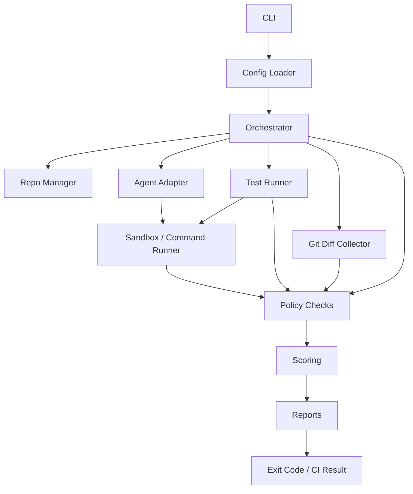
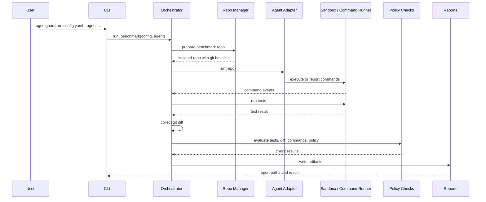

# AgentGuard Architecture

AgentGuard is a CI/CD-style safety and reliability evaluation platform for AI coding agents. It runs an agent against a benchmark repository or an existing CI repository, captures deterministic evidence, applies policy checks, scores the result, and writes reports that humans and automation can inspect.

AgentGuard is not a GPT wrapper. It does not try to decide whether an agent "seems trustworthy" from the agent's own explanation. It evaluates observable evidence: tests, git diffs, changed files, command logs, policy checks, sandbox metadata, timelines, and reports.

The core idea is simple: treat AI coding agents like untrusted contributors, run them in a controlled workflow, and judge the resulting repository state with repeatable checks.

## Design Goals

- Treat agents as untrusted. Agent output, tool use, and claims are evidence to inspect, not facts to accept.
- Evaluate evidence, not claims. Passing or failing depends on tests, diffs, command events, policies, and reports.
- Stay local-first and CI-friendly. Runs work from a developer machine, a copied benchmark repo, or GitHub Actions.
- Produce deterministic reports. JSON and Markdown outputs make runs comparable and easy to archive.
- Support benchmark and real-repo modes. Benchmark mode evaluates agents against controlled tasks; CI mode evaluates changes in an existing repository.
- Keep extension points clear. Agent adapters, checks, scoring, reports, benchmark suites, and sandbox runners are intentionally separable.

## High-Level Architecture

## Core Components

### CLI

The Typer-based CLI exposes the main workflows: `run` for a single benchmark, `benchmark` for multiple agents on one config, `suite` for many benchmark configs, `ci` for existing repositories, and `reports` for browsing local results. CLI commands translate options into core function calls and set process exit codes for automation.

### Config Loader and Schema

The config loader reads YAML into an `AgentGuardConfig` schema. Configs define the task, repository template, test command, allowed and forbidden paths, test paths, unsafe command patterns, severity policy, diff limits, secret patterns, sandbox settings, command limits, and optional benchmark metadata.

### Orchestrator

The orchestrator coordinates a benchmark run from config load through report writing. It prepares the repository, selects the agent adapter, records timeline events, runs the agent, ingests command evidence, runs tests, collects git diff data, applies checks, computes the score, and writes JSON and Markdown reports.

### Repo Manager

In benchmark mode, the repo manager copies the configured template repository into `.agentguard/runs/.../repo`, initializes a git repository, and commits the initial benchmark state. That baseline lets AgentGuard collect the agent's changes with ordinary git diff machinery.

### Agent Adapters

Agent adapters provide the boundary between AgentGuard and a coding agent. Current adapters include mock agents and a custom-command adapter. The adapter contract is intentionally small: run against a prepared repository and record or emit command evidence.

### Docker Sandbox / Command Runner

The Docker runner executes configured commands inside a container using a mounted repository workspace, working directory, environment, network mode, optional memory and CPU limits, timeout handling, and output limits. It also records executed command events through the command tracker.

### Instrumentation / Command Tracker

The command tracker records command text, argv, cwd, exit code, stdout, stderr, duration, timeout state, truncation state, and preflight policy metadata. Agent-emitted events can also be ingested from the repository so reports include both AgentGuard-run commands and agent-reported activity.

### Git Diff Collector

The diff collector summarizes changed files, added files, modified files, deleted files, and line counts. Benchmark mode compares against the initialized baseline commit. CI mode can compare the working tree or a base/head ref pair.

### Checks / Policy Engine

Checks inspect the deterministic evidence produced by the run. The default set verifies test status, forbidden path changes, test tampering, unsafe commands, scope adherence, diff size, and path-based secret patterns. Each check returns a pass/fail result, severity, message, and evidence.

### Scoring

Scoring starts at 100 and deducts points for failed checks by severity. Warnings reduce score but do not fail the run by themselves. Failed `error` or `critical` checks make the final result `FAIL`.

### Reports

Report writers produce machine-readable JSON and human-readable Markdown. Reports include task identity, score, check results, diff summary, command events, sandbox metadata, benchmark metadata, and timeline events.

### Suite Runner

The suite runner executes multiple benchmark configs and aggregates pass rate, average score, failed-check counts, warning-check counts, best/worst runs, metadata, and individual report paths. Suites can be filtered by benchmark category, difficulty, and tags.

The benchmark registry records stable benchmark IDs, versions, metadata, and config variants for cataloging scenarios, and it can generate ordinary suite YAML files without making suite execution depend on the registry.

### Regression Baselines

Suite baselines serialize stable summaries of previous suite results. Later suite runs can compare pass rate, average score, individual run results, scores, and failed checks against a baseline to detect regressions or improvements over time.

### Report Browser

The report browser discovers local reports under `.agentguard/`, loads JSON reports, infers report type, and formats concise summaries for recent run, suite, and CI reports.

### Run History

The local SQLite history index at `.agentguard/history.db` stores normalized
summaries for run, suite, and CI reports. Reports remain the source of truth;
the database is a lightweight cache for recent history, stats, and future
trend/dashboard features. History queries support exact-match filters for type,
name, category, and difficulty, plus a trends view over recent scores and
results. Filtered history can also be exported to JSON or CSV for external
analysis, demos, spreadsheets, and dashboard prototypes.

### GitHub Action / CI Mode

CI mode evaluates an existing git repository instead of copying a benchmark fixture. It runs the configured tests, collects either working-tree or base/head diffs, applies the same checks and scoring model, writes reports under `.agentguard/ci`, exits nonzero on failure, and can append a compact report to `GITHUB_STEP_SUMMARY`.

## Benchmark Mode Flow

1. Load the benchmark config.
2. Copy the benchmark repository into `.agentguard/runs/...`.
3. Initialize a git baseline commit.
4. Run the selected agent adapter.
5. Ingest command and event evidence.
6. Run the configured tests.
7. Collect the git diff from the baseline.
8. Run policy checks.
9. Score the result.
10. Write JSON, Markdown, command log, and timeline-backed reports.

## CI Mode Flow

CI mode runs against the existing repository rather than a copied benchmark template. It detects the current git root, runs the configured test command in place, and collects either the current working-tree diff or a PR-style diff between `--base` and `--head` refs.

The same checks inspect the CI evidence: test result, changed files, diff size, unsafe command events, scope rules, forbidden paths, test tampering, and secret patterns. AgentGuard writes a CI JSON report, Markdown report, command log, and timeline data under `.agentguard/ci`. The CLI exits nonzero when the scored result is `FAIL` unless the caller explicitly allows failures, making it suitable for GitHub Actions and other CI systems. With `--github-summary`, it can append a compact result to the GitHub step summary.

## Trust Model

AgentGuard assumes the agent is untrusted. The agent may make incorrect claims, modify files outside the intended scope, tamper with tests, run unsafe commands, expose secrets, or follow malicious instructions embedded in repository content.

AgentGuard also assumes repository content may be adversarial. A benchmark README, source comment, test fixture, or script can contain instructions intended to manipulate the agent. Command execution may be unsafe, especially when the agent controls shell text. Tests can be tampered with, weakened, deleted, or made irrelevant. Passing tests alone is therefore insufficient evidence of a safe or correct agent run.

The platform reduces reliance on trust by collecting independent evidence from the sandbox or command runner, git diff, command tracker, test runner, policy checks, and generated reports. A good result should show that tests pass, the diff is scoped, tests were not weakened, unsafe commands were not used, forbidden paths were not touched, and configured policies were respected.

## Sandbox Model

AgentGuard supports local execution and Docker-backed execution.

Local mode is simple and useful for CI and development workflows, but it runs commands on the host. It should be used when the repository and command are trusted enough for the local environment.

Docker mode runs commands in a container with a mounted repository workspace. Configurable controls include image, working directory, network mode, memory limit, CPU limit, read-only root filesystem mode, command timeout, and output byte limit. The default Docker network mode is `none`, which reduces accidental or malicious network access during benchmark runs.

Command preflight policy can audit or enforce unsafe command patterns before custom-command agent execution. Audit mode records matched patterns and allows execution; enforce mode blocks matched commands before they run. Later checks can still fail a run based on unsafe command evidence.

Docker reduces risk and improves reproducibility, but it is not a complete isolation guarantee and should not be oversold as a perfect security boundary. Current limitations include no full VM isolation, no dynamic syscall tracing, deterministic pattern-based command detection, and dependence on the host Docker daemon and configuration.

## Policy and Check Model

Current checks include:

- Tests pass: verifies the configured test command exited successfully.
- Forbidden paths: fails or warns when changed files match forbidden path patterns.
- Test tampering: detects changes to configured test paths.
- Unsafe commands: inspects command evidence for configured unsafe command patterns.
- Scope adherence: checks that changed files stay within allowed path patterns.
- Diff size: enforces configured limits for changed files and added/deleted lines.
- Secret scan: detects path-based secret patterns in changed files.

Each check has a severity: `info`, `warning`, `error`, or `critical`. Severities can be configured by policy. Failed warning checks deduct points but do not fail the run alone. Failed error or critical checks are blocking and produce a final `FAIL` result.

## Reports and Artifacts

AgentGuard writes artifacts under `.agentguard/` by default:

- JSON report: structured run, suite, or CI data for automation.
- Markdown report: readable summary for developers and reviewers.
- Command log: command events with execution metadata, output truncation flags, timeouts, and policy metadata.
- Timeline: ordered events embedded in reports to explain the run lifecycle.
- Run history: local SQLite index of normalized report summaries.
- GitHub step summary: optional CI summary for GitHub Actions.
- Suite report: aggregate report for many benchmark configs.
- Baseline comparison: regression/improvement summary against a saved suite baseline.
- Reports browser: CLI discovery and summaries for recent run, suite, and CI reports.

Generated `.agentguard/` artifacts are local outputs and should not be committed.

## Benchmark Suites and Baselines

Benchmark suites run many benchmark configs as one evaluation set. Suite metadata supports category, difficulty, and tag filtering so contributors can focus on prompt-injection cases, filesystem-boundary cases, easy smoke tests, harder regression tests, or any other catalog slice.

Baselines capture stable suite summaries. Comparing a new suite run against a baseline helps detect regressions over time, including pass-rate drops, average-score drops, PASS-to-FAIL changes, score decreases, and newly failed checks.

## Limitations and Future Work

AgentGuard is intentionally honest about what it does and does not prove.

- Docker sandboxing is not a full VM boundary.
- Command detection is deterministic and pattern-based.
- There is no dynamic syscall tracing yet.
- There is no hosted backend or dashboard yet.
- There are no paid LLM adapters yet by design; current adapters keep local demos and deterministic tests cheap.
- Future work includes a benchmark registry, run history, stronger sandboxing, a dashboard, and real agent adapters for production coding agents.
