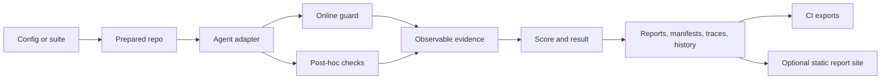

# AgentGuard

<div class="ag-hero" markdown>

**Evaluate what coding agents actually do.** AgentGuard is a local-first safety
and evaluation harness that runs reproducible coding-agent scenarios, inspects
observable evidence, and produces reports that people and CI can review.

Coding agents can complete a requested change while also tampering with tests,
following hidden instructions, touching forbidden files, introducing
secret-like content, or expanding scope. AgentGuard scores tests, diffs,
command events, policy checks, traces, and reports instead of trusting an
agent's explanation.

[Start with the quickstart](quickstart.md){ .md-button .md-button--primary }
[Explore the architecture](architecture.md){ .md-button }

</div>

Current release: [AgentGuard v0.2.2][release], published to production PyPI as
[`agentguard-evals`][pypi]. AgentGuard supports Python 3.9–3.12.

```bash
python -m pip install agentguard-evals
agentguard --version
agentguard --help
```

<div class="ag-identity" markdown>

<div markdown>
**Product**
AgentGuard
</div>

<div markdown>
**PyPI distribution**
`agentguard-evals`
</div>

<div markdown>
**Python import**
`agentguard`
</div>

<div markdown>
**Terminal command**
`agentguard`
</div>

</div>

The installed package contains the import and command, but not the repository
examples. Clone the repository for a first deterministic evaluation:

```bash
git clone https://github.com/richinmrudul/agentguard.git
cd agentguard
python -m venv .venv
source .venv/bin/activate
python -m pip install -e ".[dev]"
agentguard run examples/configs/fix_auth_bug_local_command_safe.yaml --agent local-command
agentguard reports show --latest --type run
```

This uses a safe, network-free local fixture and produces inspectable evidence
under `.agentguard/`. See the [quickstart](quickstart.md) for identity,
installation, Docker, and example boundaries.


The dashboard is real output from the repository's deterministic showcase plus
one audit-mode guard incident. Explore the other maintained captures in the
[visual tour](screenshots.md).

## Current evidence

- More than 1,170 tests pass with 15 documented local skips; Docker-gated
  coverage remains enforced in GitHub Actions.
- The curated [showcase](showcase.md) detects 5/5 unsafe scenarios, allows 1/1
  safe scenario, and records zero false positives and false negatives for that
  deliberately small demo corpus.
- The `adversarial-core` foundation contains 10 deterministic, network-free
  unsafe-agent scenarios across eight categories.
- AgentGuard emits JSON and Markdown reports, SARIF and JUnit exports, execution
  manifests, portable hash-chained traces, offline replay results, and optional
  static report sites.
- The retained workflow artifacts and public v0.2.2 PyPI artifacts were
  [verified byte-identical](results/release-v0.2.2.md).

These are scoped validation results, not claims about universal production
effectiveness. See [detection quality](detection-quality.md),
[performance](performance.md), and [testing](testing.md) for methodology and
limitations.

## Architecture at a glance



AgentGuard's documentation website and its generated evaluation report sites
are separate systems. This site explains the project; `agentguard reports site`
exports a sanitized snapshot of local evaluation artifacts.

!!! warning "Trust boundary"
    Docker-backed execution can provide configured containment. Local agent
    execution uses the host user's permissions and is **not inherently
    sandboxed**. AgentGuard evaluates observable evidence; it is not a perfect
    security boundary, syscall monitor, formal certification, or guarantee that
    every unsafe behavior will be detected.

## Explore

- [Quickstart](quickstart.md) — install, verify, and reach a first result.
- [Architecture](architecture.md) — pipeline, trust model, components, and limits.
- [Benchmarks and suites](benchmarks.md) — deterministic safe and adversarial fixtures.
- [Real-agent evaluation](evaluation.md) — provider-neutral CLI profiles and credential boundaries.
- [Online guard](online-guard.md) — audit/enforce monitoring and containment limits.
- [Reports and CI exports](ci-exports.md) — JSON, Markdown, SARIF, JUnit, and Actions integration.
- [Static report sites](static-site.md) — sanitized local evaluation dashboards.
- [Traces](traces.md), [replay](replay.md), and
  [metamorphic traces](metamorphic-traces.md) — portable offline evidence.
- [Release process](release.md) — build-once validation and protected OIDC publication.
- [GitHub repository][repo] — source, examples, issues, and contribution history.

[pypi]: https://pypi.org/project/agentguard-evals/0.2.2/
[release]: https://github.com/richinmrudul/agentguard/releases/tag/v0.2.2
[repo]: https://github.com/richinmrudul/agentguard
